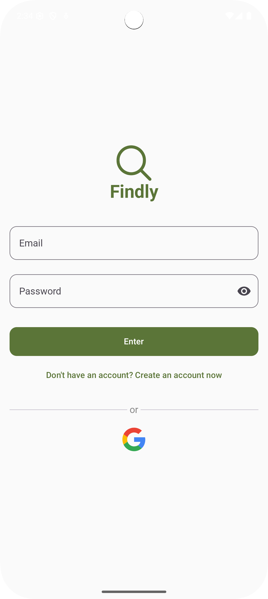

# Findly

**Findly** is a classified ads app where users can create, view, edit, and manage ads easily. Perfect for offering services, selling, renting, or finding job opportunities. 💼🏠🔧

---

## Features

- 🔐 **Firebase Authentication** (Email/Password & Google Sign-In)
- 📝 **Ad Management** (Create, Read, Update, Delete)
- 🏷️ **Ad Types**: Work, Home, Selling, Renting, Service
- 📷 **Image Upload** (via Firebase Storage)
- 📍 **Dynamic Fields** based on ad type
- 🌐 **International Phone Codes Support**
- 📅 **Expiration Date** and **Visibility** settings
- 🧭 **Navigation** with Fragments + Compose Screens
- 💾 **Persistence** with Firestore

---

## Tech Stack

- **Kotlin** + **Jetpack Compose**
- **Firebase** (Auth, Firestore, Storage)
- **Hilt** (DI)
- **Coil** (Image loading)
- **Navigation Component** (with SafeArgs)
- **Coroutines + StateFlow**

---

## Project Structure

```
- app/
  - ui/               # Fragments + ViewModels (Hilt)
  - presentation/     # Compose Screens + States
  - model/            # Models (Ad, Enums, States)
  - repository/       # Firebase Data Layer
  - util/             # Utilities & Reusable Components
```

---

## Getting Started

### 1. Clone the repository:

```bash
git clone https://github.com/danielvilha/findly.git
cd findly
```

### 2. Firebase Setup:

- Create a project on [Firebase Console](https://console.firebase.google.com/)
- Add your Android app:
    - **Package Name:** `com.danielvilha.findly`
    - Download the `google-services.json` file and place it in `app/`
- Enable:
    - Firebase Authentication (Email/Password and Google)
    - Cloud Firestore
    - Firebase Storage

### 3. Web Client ID:
- Go to **Authentication > Sign-in Method > Google** and enable it.
- Copy your **Web Client ID** and add it to `strings.xml`:
```xml
<string name="WEB_CLIENT_ID">YOUR_WEB_CLIENT_ID</string>
```

### 4. Build & Run:

- Open in **Android Studio** (recommended version Arctic Fox or later).
- Run: **Run > Run 'app'**.

---

## Screenshots

| Login                                                                            | Home                                                                              | Create Ad                                                                         | My Ads                                                                             |
|----------------------------------------------------------------------------------|-----------------------------------------------------------------------------------|-----------------------------------------------------------------------------------|------------------------------------------------------------------------------------|
|  |  |  |  |

---

## Features in Detail

### Ad Types:
- **Work**: Required fields – Phone, Email, Address, URL.
- **Home / Selling / Renting / Service**: Require images.

### Validation:
- Required fields are highlighted in red.
- Error messages shown via **AlertDialog**.

### Actions:
- **FAB**: Create new ad.
- **Drawer Menu**:
    - My Profile (coming soon)
    - My Ads
    - Logout

---

## Author

- **Daniel Vilha**
- [LinkedIn](https://www.linkedin.com/in/danielvilha)
- Project with Kotlin + Compose + Firebase.

---

## License

Copyright 2025 Daniel Vilha

Permission is hereby granted, free of charge, to any person obtaining a copy of this software and associated documentation files (the “Software”), to deal in the Software without restriction, including without limitation the rights to use, copy, modify, merge, publish, distribute, sublicense, and/or sell copies of the Software, and to permit persons to whom the Software is furnished to do so, subject to the following conditions:

The above copyright notice and this permission notice shall be included in all copies or substantial portions of the Software.

THE SOFTWARE IS PROVIDED “AS IS”, WITHOUT WARRANTY OF ANY KIND, EXPRESS OR IMPLIED, INCLUDING BUT NOT LIMITED TO THE WARRANTIES OF MERCHANTABILITY, FITNESS FOR A PARTICULAR PURPOSE AND NONINFRINGEMENT. IN NO EVENT SHALL THE AUTHORS OR COPYRIGHT HOLDERS BE LIABLE FOR ANY CLAIM, DAMAGES OR OTHER LIABILITY, WHETHER IN AN ACTION OF CONTRACT, TORT OR OTHERWISE, ARISING FROM, OUT OF OR IN CONNECTION WITH THE SOFTWARE OR THE USE OR OTHER DEALINGS IN THE SOFTWARE.